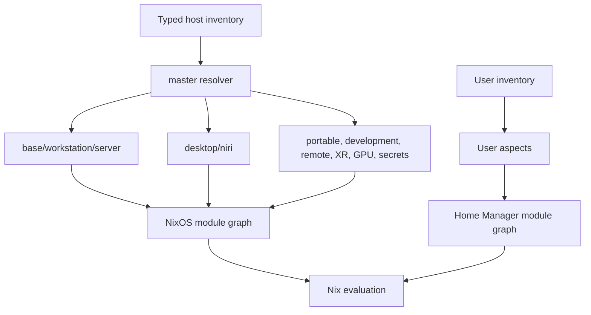

# Configuration factory architecture

This repository uses Den v0.18.0 to make host and user composition explicit.
The pinned Den revision is recorded in `flake.lock`; the implementation uses
Den's `flakeModule`, typed `den.schema` extensions, named aspects, and the
native aspect `meta` field.

## Declaration

`modules/den/inventory.nix` is the host inventory. It contains facts, not
configuration modules:

| Host | Role | Desktop | GPU | User environment |
| --- | --- | --- | --- | --- |
| `asus` | workstation | Niri | AMD | `schlich` + Home Manager |
| `asus-headless` | server | none | AMD | `schlich` |
| `asus-usb` | workstation | Niri | AMD | `schlich` + Home Manager |
| `homelab` | server | none | Intel | `schlich` |

The schema in `modules/den/schema.nix` types the `profile`, `policy`, and user
fields. Generated hardware and storage files remain host-local facts. The
host-platform aspects include those files without moving disk UUIDs, bootloader
settings, encryption, mounts, or swap into generic code.

Reusable behavior is split into focused aspects under `modules/den/aspects/`:

- `base`, `workstation`, and `server` select system behavior.
- `desktop-niri`, `laptop`, `development`, `remote`, `secrets`, `gpu-amd`, and
  `xr` represent capabilities.
- `users/core`, `users/terminal`, and `users/schlich` keep the personal
  environment independent from any one host.

The named `master` aspect is the resolver. It reads `host.profile` and
composes the capability aspects. Hosts only include `master` plus their
legitimate host-local platform/storage aspect.



## Verification and policy

`modules/den/inventory.nix` rejects combinations that are unsafe or
meaningless for this repository, including server + Niri, XR without a
graphical workstation, missing secrets infrastructure when secrets are opted
in, and critical automatic deployment without review, rollback, and health
checks.

`myConfig.aspectPolicy` is a typed registry of aspect risk and reviewer
domains. Each aspect copies its registry entry into Den's supported `meta`
field, so the resolved aspect graph carries review context without inventing a
Den API. Storage and boot-related host aspects are critical; remote and XR are
high risk; development and terminal-oriented behavior is low risk.

The main verification boundary is `nix flake check path:.`. It includes
inventory/policy checks, evaluation and one independent build check for every
declared NixOS host, the generated Home Manager activation/check farm, Niri
validation, Zellij validation, and whitespace validation. Den supplies the
host configuration map, while each host contributes one system derivation so
the Nix scheduler can build them independently:

```text
denFlake.nixosConfigurations
  -> den-host-build-asus
  -> den-host-build-asus-headless
  -> den-host-build-asus-usb
  -> den-host-build-homelab
```

Full system outputs remain available for targeted builds:

```text
nix build path:.#nixosConfigurations.asus.config.system.build.toplevel
nix build path:.#nixosConfigurations.asus-headless.config.system.build.toplevel
```

The GitHub workflow continues to build the headless system before the desktop
system and Home Manager checks.

## Safe operations and recovery

The normal future flow is:

```text
desired declaration -> Den schema -> aspect graph -> evaluation -> build/checks
                                      -> risk policy -> test or review
                                      -> deploy -> health checks -> accept/rollback
```

This migration does not switch the live machine. The generated Den outputs keep
the existing names under `nixosConfigurations`; the old manually assembled
systems remain available under `legacyNixosConfigurations` while the migration
settles. Host-local hardware files and the old `configuration*.nix`/`home.nix`
entrypoints are intentionally retained as recovery references. A future
deployment script should build first, optionally run `nixos-rebuild test`, run
host health checks, and only then request explicit approval for a switch.

Secrets remain encrypted repository inputs; plaintext secrets must never be
placed in the Nix store or inventory.
